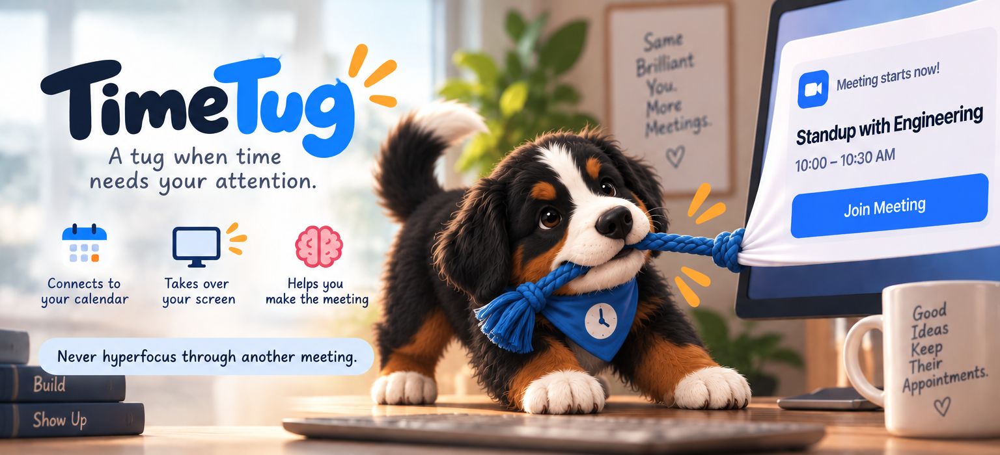

<p align="center">
  
</p>

# TimeTug

A tug when time needs your attention. TimeTug lives in your macOS menu bar, lists today's meetings,
and takes over every screen shortly before a meeting starts, so you don't hyperfocus through it.

## Features
- Reads Apple Calendar (iCloud, Google and Exchange accounts added to macOS) via EventKit
- Full-screen takeover on every display at a configurable lead time (0 = "starting now"), with Join, Snooze and Dismiss
- Detects Zoom, Meet, Teams, Webex and similar links for a one-click Join
- Per-calendar opt-in for takeovers; never takes over for all-day events; skips declined and solo events by default
- Menu bar: icon only (default), next meeting, or countdown

## Build
Requires macOS 14+ and Xcode 27.

```bash
xcodegen generate --spec Apps/macOS/project.yml
```

```bash
xcodebuild -project Apps/macOS/TimeTug.xcodeproj -scheme TimeTug -destination 'platform=macOS' build
```

Core logic tests: `swift test --package-path Packages/TimeTugCore`

## Architecture
`Packages/TimeTugCore` (portable logic), `Packages/EventKitSource` (Apple Calendar), `Apps/macOS` (the app).
See `docs/architecture.md`. Agents and contributors: read `AGENTS.md`.

## Status
Early development.

## License
The source code is released under the [MIT License](LICENSE). Licensing for the brand artwork in `artwork/` and the app's asset catalog has not been decided separately yet.
